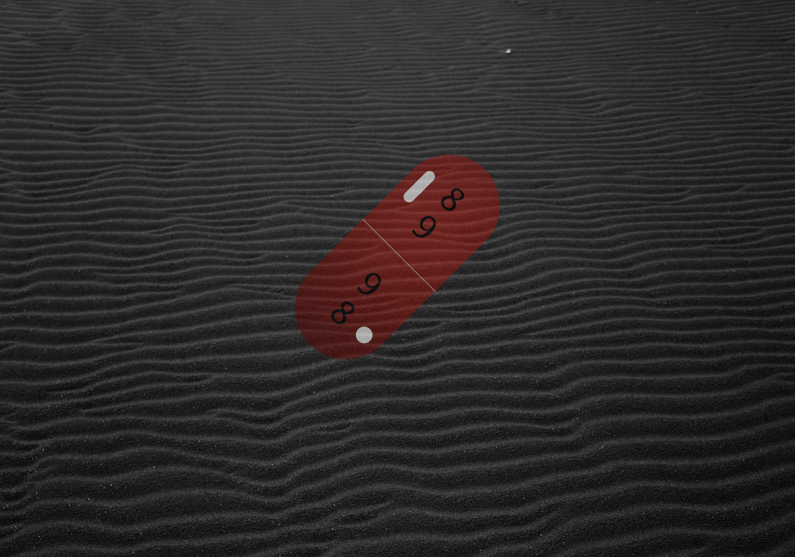
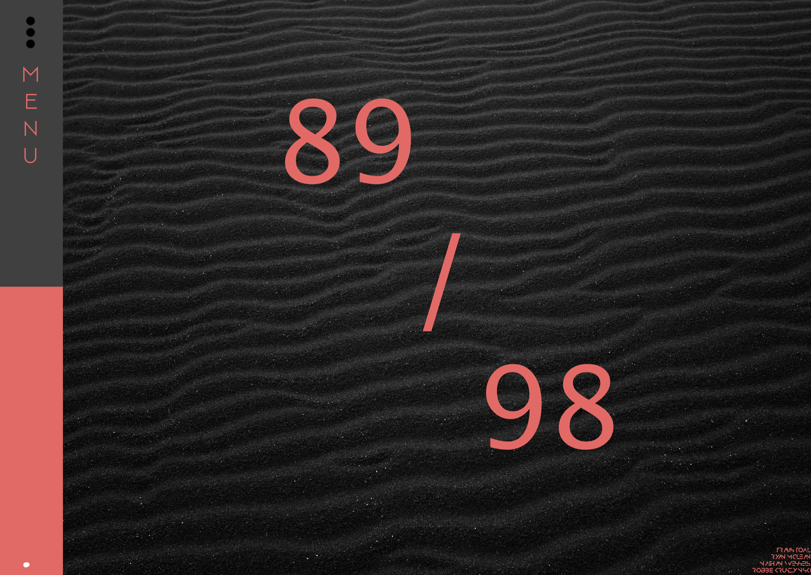
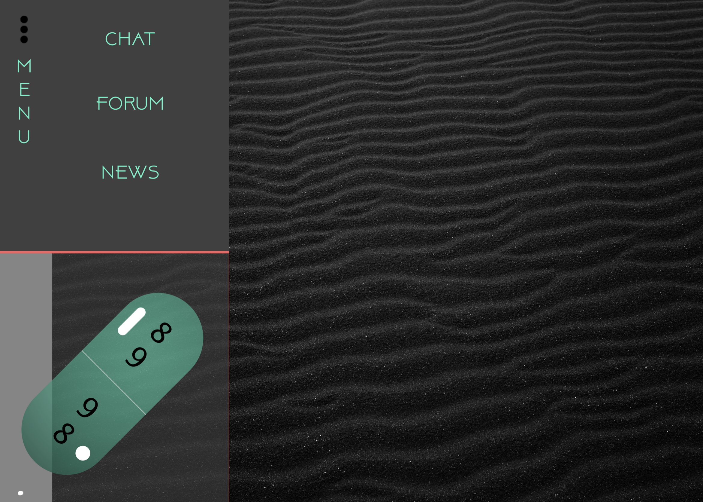
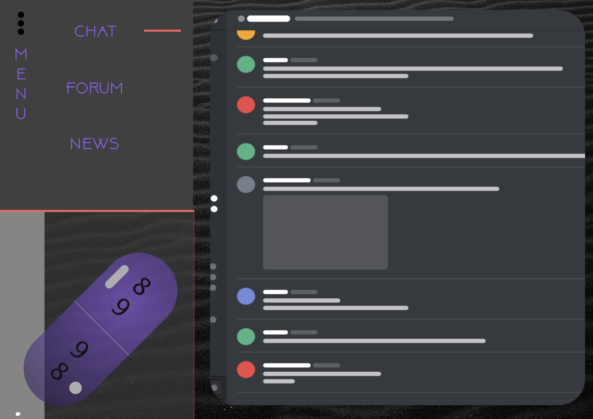
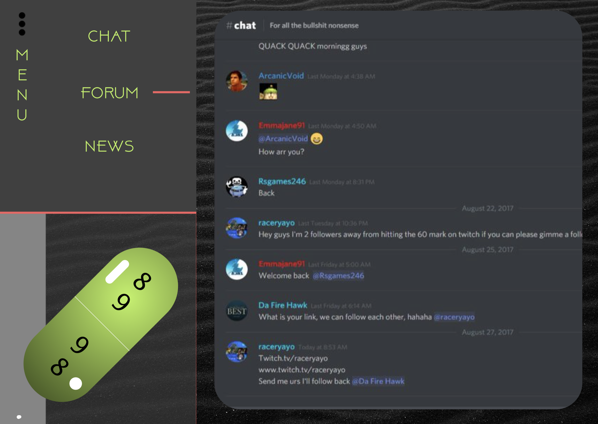
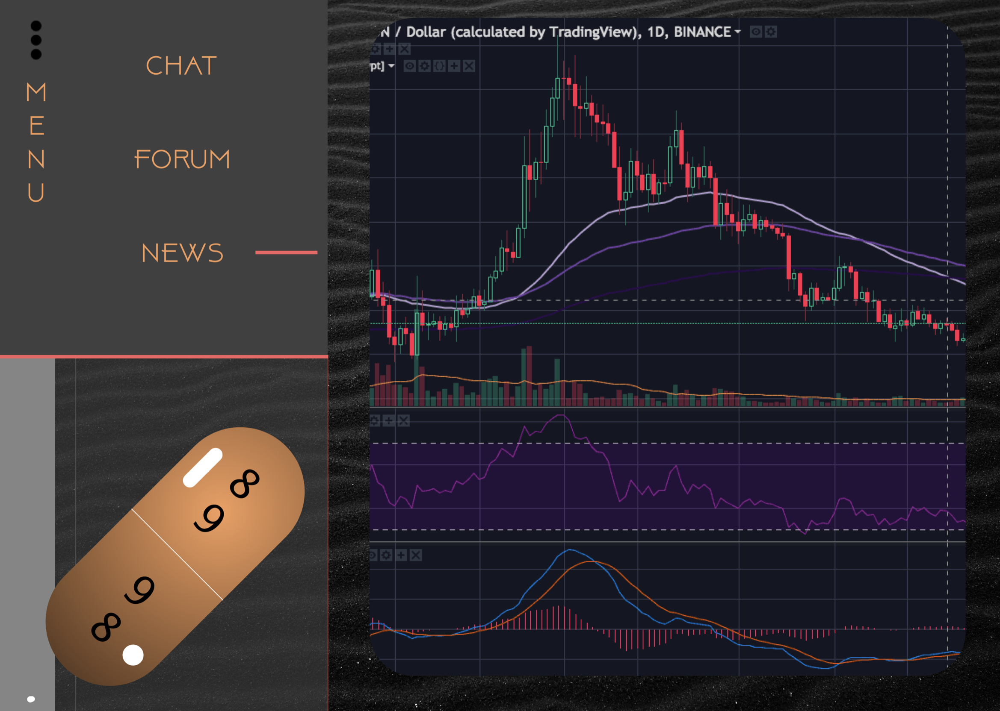

# 89 / 98

### Created by:
* `Robbie Kruszynski`
* `Ryan McLean`
* `Travis Toal`
* `Nate Wessels`

## Team Project
* start date 04/08/19
* deployment date 04/11/19

## Research
* Team stand up to brainstorm concepts attempting to consider mass adoption of chat function
* Platform for conversing without login doesn't seem readily available
* Difficult navigation on platforms in relation to cryptocurrency articles / forums
* Decide to create an open platform with immediate access / accessible navigation

## Description (current)
* 89/98 is an application that creates a chat platform for users to anonymously communicate with others with the primary intention of discussion / research regarding cryptocurrency.

## Description (goal)
* Create a forum platform for registered users
* Provide news articles in relation to top trading coins

### Setup/Installation Requirements
* Open your preferred browser
* copy / paste
* https://github.com/travisty12/chat
* Make sure you're in your Desktop directory
* clone or download the following .git https://github.com/travisty12/chat.git
* Open your terminal and navigate to the chat directory
(cd desktop --cd chat)
* Once in your terminal and proper directory run the command
`npm install` (provided you are free of errors continue and run the next command)
* `npm ng serve -open` (should automatically open in your default browser)
*  This will result in running on a local host

### Setup/Installation Requirements for Live Deployment

## Screenshots alpha phase / sketch concepts
* 

## Screenshots WireFrame / Prototype // static
* 
* 
* 
* 
* 
* 

## Screenshots WireFrame / Prototype // live
* 

## Screenshots of Build/ Live Deployment
* 

This project was generated with [Angular CLI](https://github.com/angular/angular-cli) version 7.2.3.

## Known Bugs
_As of April 11th 2019 there are no known bugs_

## List of Technologies Resources
* HTML
* CSS
* SCSS
* Angular
* Typescript

## Further help

To get more help on the Angular CLI use `ng help` or go check out the [Angular CLI README](https://github.com/angular/angular-cli/blob/master/README.md).

#### Developmental Roadmap
* Continue to buildout all maps for mobile / desktop / tablet
* Develop functionality with Log/In Authentication
* Develop functionality private messages for registered users

### License

*{This software is licensed under the MIT license} Copyright (c) 2019 {Robbie Kruszynski}*

Copyright (c) 2019
**_Robbie Kruszynski_**
**_Ryan McLean_**
**_Travis Toal_**  
**_Nate Wessels_**
