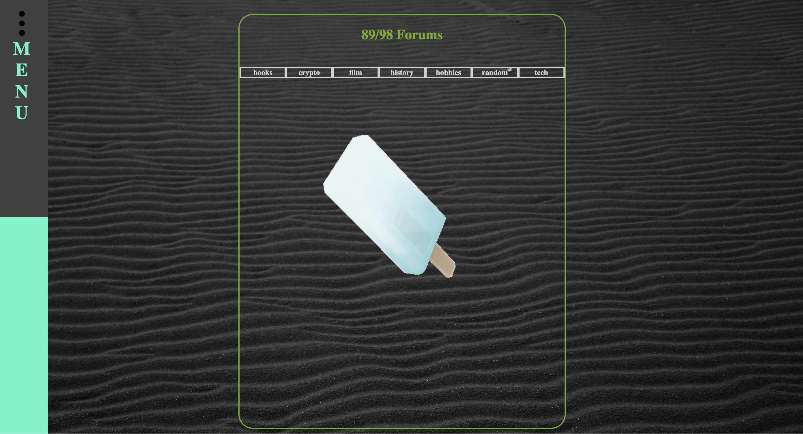

# 89 / 98

for a live viewing please visit: https://spawntrnr8998.firebaseapp.com/

### Created by:
* `Robbie Kruszynski`
* `Ryan McLean`
* `Travis Toal`
* `Nate Wessels`

## Team Project
* start date 04/08/19
* deployment date 04/11/19

## Research
* Team stand up to brainstorm concepts attempting to consider mass adoption of chat function
* Platform for conversing without login doesn't seem readily available
* Difficult navigation on platforms in relation to cryptocurrency articles / forums
* Decide to create an open platform with immediate access / accessible navigation

## Description (current)
* 89/98 is an application that creates a chat platform for users to anonymously communicate with others with the primary intention of discussion / research regarding cryptocurrency along with other social interests.
* Forum is available to discuss topics in a stored database upon forum selection.
* News in reaction to alt coins is viewable and updates.

### Setup/Installation Requirements
* Open your preferred browser
* copy / paste
* https://github.com/travisty12/chat
* Make sure you're in your Desktop directory
* clone or download the following .git https://github.com/travisty12/chat.git
* Open your terminal and navigate to the chat directory
(cd desktop --cd chat)
* Once in your terminal and proper directory run the command
* `npm install` (provided you are free of errors continue and run the next command)
* `npm ng serve -open` (should automatically open in your default browser)
*  This will result in running on a local host

### Setup/Installation Requirements for Live Deployment
* You will need to create an api file
`touch src/app/api-keys.ts`
* You are required you to have a firebase project setup so please go to https://www.firebase.com and sign in with your google account then select Console in the top right corner
* Create a new project. Your project name should align with the overall project. Name it angular-nike.
* Open Angular-nike folder in your text editor.
* Locate the api-keys.ts file that we created in the project
* Inside this file add this line
`export const masterFirebaseConfig = { apiKey: "xxxx", authDomain: "xxxx.firebaseapp.com", databaseURL: "https://xxxx.firebaseio.com", storageBucket: "xxxx.appspot.com", messagingSenderId: "xxxx" };`

* Navigate to https://www.firebase.com and click on Go To Console in the top right corner. Select the project we just created. In Project overview you should see a symbol that looks like this </> click it and that showcase in the info you need

* In your api-keys.ts file replace all the x with the information that firebase gave you.
* You may run npm start of ng serve -open to bring up a live version of the website through your local host
* Make sure you view the rules under Database and they are set to true in order to run and edit the live version hosted on firebase.

* go in your terminal and run firebase deploy
*  copy and paste the link proved in your browser to view the live version

## Screenshots alpha phase / sketch concepts
* 

## Screenshots WireFrame / Prototype // static
* 
* 
* 
* 
* 
* 

## Screenshots WireFrame / Prototype // live
* 

## Screenshots of Build/ Live Deployment
* 
* 
* 
* 
* 

This project was generated with [Angular CLI](https://github.com/angular/angular-cli) version 7.2.3.

## Known Bugs
_As of April 11th 2019 there are no known bugs_

## List of Technologies Resources
* HTML
* CSS
* SCSS
* Angular
* Typescript
* API
* Firebase

## Further help

To get more help on the Angular CLI use `ng help` or go check out the [Angular CLI README](https://github.com/angular/angular-cli/blob/master/README.md).

#### Developmental Roadmap
* Develop functionality with Log/In Authentication
* Develop functionality private messages for registered users

### License

*{This software is licensed under the MIT license} Copyright (c) 2019 {Robbie Kruszynski}*

Copyright (c) 2019
**_Robbie Kruszynski_**
**_Ryan McLean_**
**_Travis Toal_**  
**_Nate Wessels_**
